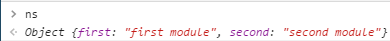

### How to include non-module libraries in a browserify bundle

```html
<!DOCTYPE html>
<html lang="en">
<head>
    <meta charset="UTF-8">
    <title>browserify test</title>
</head>
    <body>
        <div style="white-space: pre;" id="output"></div>
        <script type="text/javascript" src="src/fake-lib.js"></script>
        <script type="text/javascript" src="dist/bundle.js"></script>
    </body>
</html>
```

#### The answer is to use [browserify-shim][1]
##### Test code

fake lib stubbed from [jQuery](https://jquery.com/), which adds a name space `ns` to the global object:
```js
/**
 * fake-lib.js
 * 
 * jQuery-like stub for testing jquery behaviour in modules
 * 
 * returns a test namespace instead of the jQuery object
 * 
 */

(function(global, factory) {
    if(typeof module === "object" && typeof module.exports === "object") {

/**
 *
 *      For CommonJS and CommonJS-like environments where a proper `window`
 *      is present, execute the factory and get jQuery.
 *      For environments that do not have a `window` with a `document`
 *      (such as Node.js), expose a factory as module.exports.
 *      This accentuates the need for the creation of a real `window`.
 *      e.g. var jQuery = require("jquery")(window);
 *      See ticket #14549 for more info.
*/
        module.exports = global.document ?
             factory(global, true) :
             function(w) {
                 if(!w.document) {
                     throw new Error("jQuery requires a window with a document");
                 }
                 return factory(w);
             };
    } else {
        factory(global);
    }
})(typeof window !== "undefined" ? window : this,
    function(window, noGlobal) {
        var _ns = {};
        _ns.first = "first module";
        _ns.second = "second module";

/**
 *		Register as a named AMD module, since jQuery can be concatenated with other
 *		files that may use define, but not via a proper concatenation script that
 *		understands anonymous AMD modules. A named AMD is safest and most robust
 *		way to register. Lowercase jquery is used because AMD module names are
 *		derived from file names, and jQuery is normally delivered in a lowercase
 *		file name. Do this after creating the global so that if an AMD module wants
 *		to call noConflict to hide this version of jQuery, it will work.
 *		Note that for maximum portability, libraries that are not jQuery should
 *		declare themselves as anonymous modules, and avoid setting a global if an
 *		AMD loader is present. jQuery is a special case. For more information, see
 *		https://github.com/jrburke/requirejs/wiki/Updating-existing-libraries#wiki-anon
 *
 */
        if ( typeof define === "function" && define.amd ) {
            define( "ns", [], function() {
                return ns;
            } );
        }
        if ( !noGlobal ) {
            window.ns = _ns;
        }

        return _ns
    });
```
fake app to consume the lib:
```js
/**
 * app.js
 *
 * Isomorphic test to shim jQuery-like stub
 * 
 * shims jQuery stub in node by using simple-jsdom
 * designed to be built with --ignore simple-jsdom
 * writes to the document in the browser or to the console in node
 *
 * if the require returns
 *  a proper namespace
 *  -   just use _ns as the namespace
 *  an empty object
 *  -   fall back on a global namespace
 *  a function
 *  -   assume the lib module is asking for a window object to act as global
 *
 */
var t, _ns = require("./src/fake-lib.js");

if((t = typeof _ns) === 'object'){
    /**
     * if the object has members then this is the namespace, otherwise fall back on
     * window.ns
     *
     * run the app
     */
    _ns = Object.keys(_ns).length ? _ns : ns;
    main();
}else if(t === 'function') {
    /**
     * if a function is returned, assume it is asking for a window object
     * assume that the callback returns the window object decorated with the exported
     * namespace.
     * This is the behaviour in node, this code is dead in the browser and simple-jsdom
     * needs to be --ignore 'ed, --exclude 'ed in the build
     *
     * run the app
     * */
    var jsdom = require('simple-jsdom');

    jsdom.env(
        "https://github.com/cool-Blue/broserifyTest/tree/without-global",
        function (err, window) {
            _ns = _ns(window);
            main();
        }
    )
}

function main(){
    function op(t){
        this.document
            ? document.getElementById("output").textContent += t + "\n"
            : console.log(t);
    };

    op(_ns.first);
    op(_ns.second);

}
```
#### Option 1
 * **_include the lib in the bundle_**
 * **_export the global namespace member placed on window by the lib into the bundle_**


1.  If _required_, include the lib in the bundle
1.  The browserify-shim node causes the exported `ns` to be returned by `require("./src/fake-lib.js")`
1.  The included lib is wrapped so that `ns` is returned by `require("./src/fake-lib.js")`
1.  `ns` is still exposed on the global object

```html
    <body>
        <div style="white-space: pre;" id="output"></div>
        <!--<script type="text/javascript" src="src/fake-lib.js"></script>-->
        <script type="text/javascript" src="dist/bundle.js"></script>
    </body>
```
package.json
```js
"browserify-shim": {
    "./src/fake-lib.js": "ns"
},
"browserify": {
    "transform": "browserify-shim"
},
```

This is equivalent to... 
```js
"browserify-shim": {
    "./src/fake-lib.js": {"exports": "ns"}
},
```



#### Option 2 - make a local copy of the global namespace and exclude from the bundle
 * **_expose a local copy of the global namespace object (placed on window by the lib) into the bundle_**
 * **_exclude the lib from the bundle and serve it from a cdn via a script tag in the HTML_**


1.  The browserify-shim node causes the global `ns` to be returned by `require("./src/fake-lib.js")`
1.  Even if _required_, the lib will not be included in the bundle
1.  `ns` is exposed on the global object from the script tag

```html
    <body>
        <div style="white-space: pre;" id="output"></div>
        <script type="text/javascript" src="src/fake-lib.js"></script>
        <script type="text/javascript" src="dist/bundle.js"></script>
    </body>
```
package.json
```js
"browserify-shim": {
    "./src/fake-lib.js": "global:ns"
},
"browserify": {
    "transform": "browserify-shim"
},
```
This is equivalent to... 
```js
"browserify-shim": {
    "./src/fake-lib.js": {"exports": "global:ns"}
},
```
This method simply replaces 
```js
    var _ns = require("./src/fake-lib.js");
```    
with
```js
    var _ns = (typeof window !== "undefined" ? window['ns'] : typeof global !== "undefined" ? global['ns'] : null);
```
The lib code does not need to be included in the project so `./src/fake-lib.js` could be replaced by anything.
It's only purpose is to provide a reference to the exported global `ns` member to be returned by the _require_ statement.

For example...
```js
    /**
     * app.js
     */
    var _ns = require("fakeLib");
```    
and in the package.json...
```js
    "browserify-shim": {
        "fakeLib": "global:ns"
    },
```


#### Complications with including `simple-jsdom`
The `simple-jsdom` node package was included for idealistic reasons, to make the code isomorphic.  It satisfies fake-jQuery's need for a `window` object in node.  This module needs to be suppressed by browserify as it's not needed in the browser: that section is dead code in the browser so the lib would be pure bloat.  There are two ways to deal with this.

`$ browserify ./app.js -u node-jsdom -d > ./dist/bundle.js`
The [--exclude](https://github.com/substack/browserify-handbook/blob/master/readme.markdown#excluding) , or -u flag completely excludes the module from the bundle.  It is still a dependency of the consuming module and the require statement is left unchanged, but the it's value in the module map is `undefined`.  

```js
    }, {
        "./src/fake-lib.js": 2,
        "node-jsdom": undefined
    }],
```

The `var jsdom = require('node-jsdom')` statement is still in the bundle and would in fact throw an error if executed, but this is not a problem because it's dead code in the browser.


`$ browserify ./app.js -i node-jsdom -d > ./dist/bundle.js`
The [--ignore](https://github.com/substack/browserify-handbook/blob/master/readme.markdown#ignoring) flag has a similar effect, in that the module is not loaded into the bundle, but a stub is left in it's place, which is still included in the module map although again, will never be called because the code path is dead in the browser environment but, in this case it would not throw and the require would return an empty object.
```js
    }, {
        "./src/fake-lib.js": 3,
        "node-jsdom": 2
    }],
    2: [function(require, module, exports) {

    }, {}],
```
#### Option 3 - directly reference the global namespace and include in the bundle
1.  The browserify-shim node causes the `require("./src/fake-lib.js")` to execute the lib code every time (thus, re-decorating the global object)
1.  If _**required**_, the lib is included in the bundle
1.  The included lib is wrapped so that `require("./src/fake-lib.js")` executes the lib code with the `this` context set to the global object

package.json
```js
"browserify-shim": {
    "./src/fake-lib.js": {"exports": null}
},
"browserify": {
    "transform": "browserify-shim"
},
```

##### How to wrap a lib that adds a namespace onto the global object and include in the bundle


```html
<!DOCTYPE html>
<html lang="en">
<head>
    <meta charset="UTF-8">
    <title>browserify test</title>
</head>
    <body>
        <div style="white-space: pre;" id="output"></div>
        <script type="text/javascript" src="dist/bundle.js"></script>
    </body>
</html>
```
This time, we want to wrap the the lib in such a way that it cannot pollute the global namespace but, can be accessed by other modules in the bundle as if it is on the global.

##### step 1 - bundle the lib as a _standalone_ module
To do this we need to use the -s option (--standalone) in the build
```js
  "browserify-shim": {
    "./src/fake-lib.js": {"exports": "ns"}
  },
  "browserify": {
    "transform": "browserify-shim"
  },
  "scripts": {
    "build": "browserify ./fake-lib.js -s ns > ../dist/lib-bundle.js",
    "build-pretty": "browserify ./fake-lib.js -s ns | js-beautify > ../dist/lib-bundle.js"
  },
```
----------
----------

[this answer][3] was super-helpful


  [1]: https://npmjs.org/package/browserify-shim
  [2]: https://github.com/substack/browserify-handbook/blob/master/readme.markdown#browserify-shim
  [3]: http://stackoverflow.com/a/25585778/2670182
